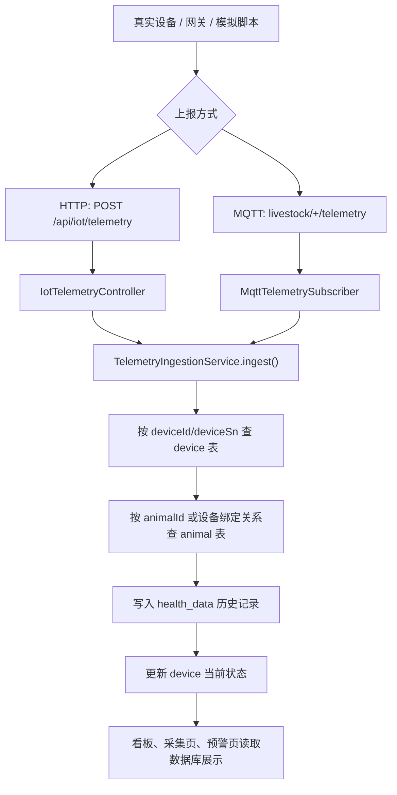

# 15-真实设备接入专项讲解

这份材料专门用来讲解“真实设备如何接入畜牧健康监测系统”。目标是让你能按顺序讲清楚：设备采集什么数据、数据通过什么协议进入系统、后端怎么接收和处理、数据存到哪里、页面为什么能展示，以及当前已经做到什么、还没有做到什么。

## 一、先用一句话讲清楚

真实设备或设备网关采集牲畜的体温、心率、活动指数、反刍、采食、电量、信号等数据后，可以通过 HTTP 或 MQTT 把数据上报到后端；后端把这些数据统一解析、匹配设备和牲畜、写入数据库；前端页面再从数据库读取数据，展示设备状态、健康趋势、活动热力图和风险提醒。

小白理解：

> 真实设备像“采集员”，HTTP 或 MQTT 像“送信方式”，后端接口像“收件处”，数据库像“档案柜”，前端看板像“展示大屏”。设备先采集数据，再把数据送给后端，后端整理后放进数据库，页面只负责把整理好的数据展示出来。

当前系统支持两条接入方式：

| 接入方式 | 入口 | 适合场景 |
|---|---|---|
| HTTP 上报 | `POST /api/iot/telemetry` | 调试方便，适合普通网关、边缘盒子、后台服务转发 |
| MQTT 上报 | `livestock/+/telemetry` | 适合物联网设备持续上报，设备数量多时更常见 |

## 二、真实设备到底采集哪些数据

真实设备可以是智能项圈、智能耳标、体温贴片、定位设备，也可以是多个传感器先接到一个网关，再由网关统一上传。

本项目目前接收的数据主要有这些：

| 字段 | 中文含义 | 举例 | 用途 |
|---|---|---|---|
| `deviceId` / `deviceSn` | 设备编号或设备序列号 | `SN100000` | 用来找到是哪台设备 |
| `animalId` | 牲畜编号 | `SHEEP001` | 用来找到是哪只羊，如果设备已绑定牲畜，也可以不传 |
| `timestamp` | 数据采集时间 | `2026-04-29T10:30:00` | 用来做趋势图和热力图 |
| `temperature` | 体温 | `38.7` | 用来判断体温是否异常 |
| `heartRate` | 心率 | `82` | 用来判断心率是否异常 |
| `activityLevel` | 活动指数 | `65` | 表示活跃程度，范围 0-100 |
| `ruminationTime` | 反刍时长 | `18` | 用来分析反刍情况 |
| `feedingCount` | 采食次数 | `3` | 用来分析采食行为 |
| `restingTime` | 休息时长 | `12` | 用来分析活动和休息情况 |
| `batteryLevel` | 电量 | `80` | 用来判断设备是否低电量 |
| `signalStrength` | 信号强度 | `-70` | 用来判断设备通信质量 |

汇报说法：

> 这里的“活动指数”不是点数，也不是点击次数，而是把设备采集到的运动强度转换成 0 到 100 的指标。数值越高，说明该时间段牲畜越活跃；数值越低，说明活动少，可能是在休息，也可能需要结合体温、心率、反刍等数据判断是否异常。

对应源码：

`backend/src/main/java/com/livestock/health/model/dto/TelemetryPayload.java`

这个 DTO 就是后端接收设备数据时使用的数据结构。里面还用了 `@JsonAlias`，意思是同一个字段可以兼容不同设备的命名方式。比如设备发 `device_sn`、`sn` 或 `deviceSn`，后端都可以识别成设备序列号。

## 三、当前没有买设备，为什么也能做

这部分要如实说明，不要夸大成“已经接入真实硬件”。

当前项目分成两步：

1. 先完成软件侧接入能力。
2. 后续买设备后，让真实设备按这个格式上报数据。

现在虽然还没有真实硬件，但是系统已经定义好了数据格式、接口、MQTT 主题、入库逻辑和模拟脚本。所以可以先用模拟脚本代替真实设备，把一条条 JSON 数据发给后端，验证整个数据链路能跑通。

可以这样讲：

> 真实设备接入不是必须等买到硬件才开始。软件系统可以先把“收数据的入口”和“处理数据的流程”做好。现在我的项目已经预留了 HTTP 和 MQTT 两种接入方式，后续只要购买的设备或网关支持 HTTP Webhook 或 MQTT 发布，就可以按照当前 JSON 格式把真实数据传进来。

当前演示数据来源有两类：

| 数据来源 | 说明 | 源码或脚本 |
|---|---|---|
| 初始化演示数据 | 系统启动时自动生成牲畜、设备和历史健康数据 | `MockDataGenerator.java` |
| 模拟设备上报 | 用脚本模拟真实设备持续发送数据 | `simulate-http-telemetry.ps1`、`publish-mqtt-telemetry.ps1` |

## 四、HTTP 接入是怎么实现的

HTTP 接入可以理解为：设备或网关主动调用后端接口，把一条健康数据作为 JSON 发过来。

接口路径：

```text
POST /api/iot/telemetry
```

请求头：

```text
X-IOT-KEY: demo-iot-key
```

示例数据：

```json
{
  "deviceSn": "SN100000",
  "timestamp": "2026-04-29T10:30:00",
  "temperature": 38.7,
  "heartRate": 82,
  "activityLevel": 65,
  "ruminationTime": 18,
  "feedingCount": 3,
  "restingTime": 12,
  "batteryLevel": 80,
  "signalStrength": -70
}
```

源码位置：

`backend/src/main/java/com/livestock/health/controller/IotTelemetryController.java`

核心流程：

1. `@RequestMapping("/api/iot")` 定义设备接入接口前缀。
2. `@PostMapping("/telemetry")` 定义 HTTP 上报地址。
3. 读取请求头 `X-IOT-KEY`。
4. 判断密钥是否和配置中的 `iot.telemetry.api-key` 一致。
5. 校验通过后，把 JSON 转成 `TelemetryPayload`。
6. 调用 `telemetryIngestionService.ingest(payload, "HTTP")` 统一处理。

汇报说法：

> HTTP 接入适合调试，也适合真实场景中的网关设备。比如多个项圈先把数据传给牧场网关，网关再统一调用 `/api/iot/telemetry`，把设备数据发给后端。后端会先检查 `X-IOT-KEY`，防止随便一个请求都能写入数据。

## 五、MQTT 接入是怎么实现的

MQTT 可以理解为物联网设备常用的消息通道。设备不是直接调用后端接口，而是把消息发布到一个主题上，后端一直订阅这个主题，一收到消息就处理。

当前默认主题：

```text
livestock/+/telemetry
```

这里的 `+` 是通配符，表示中间可以是不同设备编号。例如：

```text
livestock/SN100000/telemetry
livestock/SN100001/telemetry
livestock/SN100002/telemetry
```

源码位置：

`backend/src/main/java/com/livestock/health/service/MqttTelemetrySubscriber.java`

核心流程：

1. 后端启动时读取 MQTT 配置。
2. 如果 `mqtt.enabled=true`，就连接 MQTT Broker。
3. 订阅 `livestock/+/telemetry`。
4. 设备发布消息后，`messageArrived()` 收到 JSON 文本。
5. 用 `ObjectMapper` 把 JSON 转成 `TelemetryPayload`。
6. 调用 `telemetryIngestionService.ingest(telemetry, "MQTT:" + arrivedTopic)` 统一入库。

汇报说法：

> MQTT 更适合真实物联网设备，因为设备可以持续、小包、低成本地上报数据。后端不用不断去问设备有没有新数据，而是订阅主题，设备一发消息，后端就能收到。

MQTT 服务配置在：

`docker-compose.yml`

配置项在：

`backend/src/main/resources/application.yml`

主要配置包括：

```yaml
mqtt:
  enabled: ${MQTT_ENABLED:false}
  broker-url: ${MQTT_BROKER_URL:tcp://localhost:1883}
  client-id: ${MQTT_CLIENT_ID:livestock-backend}
  topic: ${MQTT_TOPIC:livestock/+/telemetry}
  qos: ${MQTT_QOS:1}
```

## 六、HTTP 和 MQTT 的区别

老师很可能会问：“既然有 HTTP，为什么还要 MQTT？”

可以这样回答：

| 对比点 | HTTP | MQTT |
|---|---|---|
| 通信方式 | 设备主动请求后端接口 | 设备发布消息，后端订阅消息 |
| 使用难度 | 简单，容易调试 | 需要 MQTT Broker |
| 适合场景 | 网关转发、后台服务对接、低频上报 | 多设备、持续上报、物联网场景 |
| 本项目用途 | 快速验证设备接入格式 | 更贴近真实物联网设备接入 |

汇报说法：

> 我的系统两个都支持。HTTP 主要方便调试和兼容普通网关；MQTT 更适合后续真实设备批量接入。这样设计的好处是，买到不同厂商设备后，只要它支持其中一种方式，就可以接进系统。

## 七、后端统一入库流程

不管数据来自 HTTP，还是来自 MQTT，最后都会进入同一个服务：

`backend/src/main/java/com/livestock/health/service/TelemetryIngestionService.java`

核心方法：

```java
ingest(TelemetryPayload payload, String source)
```

它做了这些事：

1. 根据 `deviceId` 或 `deviceSn` 查找设备。
2. 根据 `animalId` 或设备绑定关系查找牲畜。
3. 解析时间字段 `timestamp`。
4. 把活动指数限制在 0-100。
5. 新增一条 `HealthDataEntity`，写入 `health_data` 表。
6. 更新 `DeviceEntity` 里的当前体温、心率、活动、电量、信号和最后上报时间。
7. 如果有活动、反刍、采食、休息数据，同步更新牲畜行为更新时间。
8. 返回处理结果，比如记录 ID、设备编号、牲畜编号。

小白解释：

> 这个服务像一个“数据登记员”。它收到设备数据后，先确认“是哪台设备”，再确认“对应哪只羊”，然后把这次上报记录存到健康数据表里，同时把设备表里的最新状态更新掉。

完整数据流：

```text
真实设备或模拟脚本
-> HTTP / MQTT
-> IotTelemetryController 或 MqttTelemetrySubscriber
-> TelemetryIngestionService.ingest()
-> device 表查设备
-> animal 表查牲畜
-> health_data 表新增历史记录
-> device 表更新当前状态
-> 前端页面读取并展示
```

流程图：



## 八、数据存到哪些表

真实设备数据进入系统后，主要影响三张表。

| 表 | 对应实体 | 作用 |
|---|---|---|
| `device` | `DeviceEntity.java` | 保存设备基础信息和当前状态 |
| `animal` | `AnimalEntity.java` | 保存牲畜档案、健康评分、行为状态、绑定设备 |
| `health_data` | `HealthDataEntity.java` | 保存每一次上报的健康时序数据 |

### 1. `health_data` 表

这是最重要的历史数据表。每次设备上报，系统都会新增一条记录。

主要字段：

- `device_id`：设备数据库 ID
- `animal_id`：牲畜数据库 ID
- `farm_id`：牧场 ID
- `temperature`：体温
- `heart_rate`：心率
- `activity_level`：活动指数
- `rumination_time`：反刍时长
- `feeding_count`：采食次数
- `resting_time`：休息时长
- `data_time`：数据采集时间

源码位置：

`backend/src/main/java/com/livestock/health/model/entity/HealthDataEntity.java`

### 2. `device` 表

设备表保存的是设备当前状态。比如页面上看到某台设备当前体温、电量、信号、最后更新时间，就是从这里来的。

源码位置：

`backend/src/main/java/com/livestock/health/model/entity/DeviceEntity.java`

### 3. `animal` 表

牲畜表保存的是每只羊的档案、健康评分、风险等级、行为状态和绑定设备。

源码位置：

`backend/src/main/java/com/livestock/health/model/entity/AnimalEntity.java`

## 九、数据处理算法是什么

这部分要讲得清楚，但不要夸大。当前项目主要是“业务规则 + 统计聚合”，不是复杂深度学习模型。

### 1. 活动指数规范化

设备上报的 `activityLevel` 会被限制在 0 到 100 之间。

可以这样理解：

> 活动指数是一个百分制指标。低于 0 没有意义，高于 100 也不方便比较，所以后端会把它控制在 0-100 的范围内。

对应源码：

`TelemetryIngestionService.java` 里的 `clampPercent()`

### 2. 时间解析

设备可能用不同格式上传时间，所以后端支持多种时间写法，例如：

- `2026-04-29T10:30:00`
- 带时区的 ISO 时间
- 秒级时间戳
- 毫秒级时间戳

对应源码：

`TelemetryIngestionService.java` 里的 `parseTimestamp()`

汇报说法：

> 真实设备厂商不一定都用完全一样的时间格式，所以后端做了兼容处理。只要是常见的 ISO 时间或时间戳，系统都能转换成数据库使用的 `LocalDateTime`。

### 3. 体温和心率阈值判断

系统用阈值判断体温和心率是否异常。

默认规则在：

`backend/src/main/java/com/livestock/health/service/FarmSnapshotService.java`

当前默认值：

| 指标 | 默认正常范围 |
|---|---|
| 体温 | 38.0 到 40.5 |
| 心率 | 60 到 110 |
| 低电量 | 小于 20 |
| 信号质量 | 小于 40 认为偏弱 |

汇报说法：

> 当前疾病预警不是黑盒 AI，而是先用可解释的阈值规则做基础判断。例如体温低于下限或高于上限，就认为需要关注；心率超出范围，也会作为风险依据。

### 4. 热力图时间分桶

健康看板里的活动热力图不是直接展示一条原始数据，而是把一天分成几个时间段：

```text
00:00、04:00、08:00、12:00、16:00、20:00
```

然后对每个时间段里的数据求平均值。

对应源码：

`backend/src/main/java/com/livestock/health/service/HealthDashboardService.java`

关键逻辑：

- `DASHBOARD_TIME_BUCKETS`：定义时间段。
- `buildActivityHeatmap()`：生成热力图数据。
- `resolveDashboardBucket()`：把具体时间归到某个时间段。
- `resolveMetricValue()`：计算活动、反刍、采食、休息等指标。

汇报说法：

> 热力图的颜色深浅代表这个时间段对应指标的平均强弱。比如活动指数越高，颜色越明显；反刍、采食、休息也是按对应指标聚合出来的。

### 5. 趋势统计

趋势图会从 `health_data` 中取最近数据，然后按时间排序和聚合，展示体温趋势、活动趋势等。

可以这样讲：

> 系统不是只看当前一条数据，而是把历史数据存下来。这样就能看趋势，比如某只羊体温是不是持续升高，活动是不是突然下降，反刍是否比平时少。

## 十、前端页面为什么能看到变化

前端页面不直接连接设备，也不直接连接 MQTT。前端只调用后端业务接口，后端从数据库取数据。

例如：

| 页面 | 读取的数据 | 说明 |
|---|---|---|
| 畜牧健康数据实时采集管理 | `device` 和 `health_data` | 看设备在线状态、当前体温、电量、采集日志 |
| 个性化健康看板可视化 | `animal`、`device`、`health_data` | 看健康评分、体温趋势、活动热力图、重点关注羊只 |
| 疾病早期检测与风险评估 | `animal` 和 `health_data` | 根据体温、心率、风险等级展示风险动物 |

汇报说法：

> 设备接入和页面展示之间隔了一层数据库。这样设计比较稳定，因为前端不用关心设备协议，只要后端把数据存好，页面刷新或定时请求接口时就能看到最新数据。

## 十一、模拟演示怎么讲

演示时建议不要一上来讲命令，先讲目的。

演示目的：

> 我现在用模拟脚本代替真实设备，向系统连续上报几条健康数据。真实设备接入后，只要发同样格式的数据，就能走同一条后端处理流程。

### 1. HTTP 模拟上报

脚本位置：

`scripts/simulate-http-telemetry.ps1`

示例命令：

```powershell
.\scripts\simulate-http-telemetry.ps1 -DeviceSn SN100000 -Count 5 -IntervalSeconds 3
```

这条命令的意思：

- 用设备序列号 `SN100000`
- 模拟上报 5 条数据
- 每 3 秒上报一次
- 通过 HTTP 接口写入系统

### 2. MQTT 模拟上报

脚本位置：

`scripts/publish-mqtt-telemetry.ps1`

示例命令：

```powershell
.\scripts\publish-mqtt-telemetry.ps1 -DeviceSn SN100000 -Count 5 -IntervalSeconds 3
```

这条命令的意思：

- 把 JSON 消息发布到 MQTT
- 后端订阅到消息后自动入库
- 模拟真实物联网设备持续上报

### 3. 页面验证

演示顺序建议：

1. 打开“畜牧健康数据实时采集管理”页面，看设备状态和最新数据。
2. 打开“个性化健康看板可视化”页面，看体温趋势和活动热力图。
3. 运行 HTTP 或 MQTT 模拟脚本。
4. 刷新页面或等待自动刷新。
5. 观察设备最后更新时间、健康数据日志、看板图表是否更新。

汇报说法：

> 这里我不是手动改页面数据，而是模拟设备从后端入口写入数据库。页面变化说明从设备上报、后端接收、数据库保存、前端展示这一整条链路是打通的。

## 十二、后续买什么设备更合适

选设备时，不要只看“能不能测体温”，还要看“数据能不能开放出来”。

推荐优先选择：

| 设备类型 | 推荐原因 |
|---|---|
| 支持 MQTT 的智能项圈 | 最贴近当前 MQTT 接入方案，适合持续上报 |
| 支持 HTTP Webhook 的网关 | 容易和当前 HTTP 接口对接 |
| 带体温和运动传感器的智能耳标 | 适合采集体温和活动数据 |
| 支持开放 API 的厂商设备 | 后续接入成本低 |

购买前要问厂商这些问题：

1. 设备能不能导出实时数据？
2. 支持 MQTT 吗？
3. 支持 HTTP Webhook 吗？
4. 数据格式能不能自定义？
5. 能不能拿到设备编号、采集时间、体温、活动量、电量、信号？
6. 有没有网关？设备是直接联网还是通过网关联网？
7. 有没有开发文档或 API 文档？

汇报说法：

> 后续真实硬件选型时，我会优先选择支持 MQTT 或 HTTP Webhook 的设备，因为当前系统的软件接入口已经按这两种方式预留好了。如果设备厂商只提供自己的平台，不开放数据接口，那接入难度会比较高。

## 十三、当前已经完成什么，还没完成什么

这部分一定要如实讲，老师会更认可。

当前已经完成：

- 定义了设备上报数据结构 `TelemetryPayload`。
- 新增 HTTP 上报接口 `/api/iot/telemetry`。
- 新增 MQTT 订阅服务。
- Docker 里增加了 Mosquitto MQTT 服务。
- 后端能把上报数据写入 `health_data`。
- 后端能同步更新 `device` 当前状态。
- 前端页面可以从数据库读取并展示这些数据。
- 有 HTTP 和 MQTT 两个模拟脚本，可以在没买设备时验证链路。

当前还没有完成：

- 还没有接入真实硬件。
- 还没有对每个设备做独立密钥或证书认证。
- MQTT 当前演示环境允许匿名连接，生产环境不应该这样。
- 还没有做设备离线缓存和断点补传。
- 还没有做设备重复数据去重。
- 还没有做厂商私有协议适配。
- 设备注册、绑定、解绑流程还可以继续完善。

汇报说法：

> 当前项目完成的是软件侧接入能力，也就是系统已经能接收真实设备格式的数据。硬件侧还没有真正购买和部署，所以现在用模拟脚本验证链路。生产环境还需要进一步加强设备认证、消息加密、离线补传和数据去重。

注意：

> 如果要给老师现场演示，要确保本地运行的代码包含真实设备接入这部分，因为这部分是新增接入能力。如果 GitHub 上还没有提交这部分代码，演示时要以本机当前版本为准，或者先把代码提交上去。

## 十四、老师可能追问与回答

### 1. 没有买真实设备，为什么说能接入真实设备？

答：

因为设备接入首先要解决的是“数据怎么进系统”。当前项目已经定义好了数据格式，并实现了 HTTP 和 MQTT 两个入口。现在用模拟脚本代替真实设备上报数据，后续只要真实设备或网关按同样格式发送数据，就可以进入同一套后端处理流程。

### 2. MQTT 是什么？

答：

MQTT 是物联网常用的轻量消息协议。设备把数据发布到一个主题，比如 `livestock/SN100000/telemetry`，后端订阅这个主题。只要设备发消息，后端就能收到并处理。它比普通 HTTP 更适合很多设备持续上报小数据。

### 3. 为什么同时支持 HTTP 和 MQTT？

答：

HTTP 简单，适合调试和网关转发；MQTT 更适合物联网设备持续上报。两个都支持，可以提高兼容性。后续买到不同厂商设备时，只要支持其中一种方式，就能接入系统。

### 4. 活动指数是什么意思？

答：

活动指数是 0 到 100 的活跃程度指标。它可以由设备的加速度传感器、步数、运动强度等数据换算出来。数值越高表示越活跃，数值越低表示活动少。当前系统把它作为健康行为分析的一个指标，而不是“点数”或“次数”。

### 5. 数据处理算法是不是 AI？

答：

当前这部分主要是规则和统计聚合，不是复杂 AI。比如体温和心率用阈值判断是否异常，活动指数限制在 0-100，热力图按时间段求平均。这样做的优点是简单、可解释，老师和用户都能看懂判断依据。

### 6. 设备上报后，为什么页面能看到变化？

答：

设备上报的数据会先写入数据库。页面不是直接连设备，而是通过后端接口读取数据库里的最新数据。所以只要设备数据成功入库，页面刷新或定时请求接口后就能展示变化。

### 7. 真实设备需要怎么配置才能接入？

答：

如果设备支持 HTTP，就配置它向 `/api/iot/telemetry` 发送 JSON，并带上 `X-IOT-KEY`。如果设备支持 MQTT，就配置它连接 MQTT Broker，并向 `livestock/设备编号/telemetry` 发布 JSON 消息。字段至少要包含设备编号、时间、体温、心率或活动指数等核心数据。

### 8. 设备编号和牲畜编号怎么对应？

答：

系统先根据 `deviceId` 或 `deviceSn` 找到设备。如果数据里传了 `animalId`，就按 `animalId` 找牲畜；如果没有传，就用设备表里已经绑定的 `animalId` 来确定是哪只牲畜。所以真实使用前，需要先完成设备和牲畜的绑定关系。

### 9. 如果设备发来的时间格式不一样怎么办？

答：

后端做了常见格式兼容。支持普通 ISO 时间、带时区时间，也支持秒级或毫秒级时间戳。这样不同厂商设备的数据更容易接入。

### 10. 后续还需要完善什么？

答：

后续主要完善四点：第一是真实设备联调；第二是设备身份认证和 MQTT 账号密码；第三是离线补传和重复数据去重；第四是设备注册、绑定和运维管理。当前项目已经完成接入链路的基础能力。

## 十五、可以直接背的完整讲稿

> 这一部分我主要讲真实设备如何接入系统。我的系统不是让前端直接连接设备，而是采用“设备上报、后端入库、前端展示”的方式。真实设备或网关会采集牲畜的体温、心率、活动指数、反刍、采食、电量、信号强度等数据，然后通过 HTTP 或 MQTT 把数据发送到后端。
>
> 当前系统支持两种接入方式。第一种是 HTTP，上报地址是 `POST /api/iot/telemetry`，设备或网关把 JSON 数据发给这个接口，并在请求头里带上 `X-IOT-KEY` 做简单鉴权。第二种是 MQTT，后端订阅 `livestock/+/telemetry` 这个主题，真实设备可以把数据发布到类似 `livestock/SN100000/telemetry` 的主题上，后端收到消息后会自动解析。
>
> 这两种方式最后都会进入同一个处理服务，也就是 `TelemetryIngestionService`。它会先根据 `deviceId` 或 `deviceSn` 找到设备，再根据 `animalId` 或设备绑定关系找到对应牲畜，然后把本次上报记录写入 `health_data` 表，同时更新 `device` 表里的当前体温、心率、活动指数、电量、信号强度和最后上报时间。
>
> 这里的数据处理主要是可解释的规则和统计聚合。比如活动指数会被限制在 0 到 100 之间；体温和心率会按照阈值判断是否异常；健康看板里的热力图会把一天分成 00:00、04:00、08:00、12:00、16:00、20:00 这些时间段，再对每个时间段里的活动、反刍、采食、休息数据求平均值，用颜色深浅展示。
>
> 目前还没有真正购买硬件，所以我用模拟脚本代替真实设备发送数据。这个模拟不是手动改页面，而是通过 HTTP 或 MQTT 走真实的后端入口，把数据写入数据库。后续如果购买支持 MQTT 或 HTTP Webhook 的智能项圈、耳标或网关，只要按照当前 JSON 格式上报数据，就可以接入这套系统。
>
> 所以当前已经完成的是软件侧设备接入能力，包括数据格式、HTTP 接口、MQTT 订阅、统一入库和页面展示。后续真实落地时，还需要继续完善设备认证、消息加密、离线补传、去重和真实硬件联调。

## 十六、源码定位总表

| 要讲的点 | 源码位置 | 说明 |
|---|---|---|
| 设备上报数据结构 | `backend/src/main/java/com/livestock/health/model/dto/TelemetryPayload.java` | 定义设备能上传哪些字段 |
| HTTP 接入接口 | `backend/src/main/java/com/livestock/health/controller/IotTelemetryController.java` | 接收 `POST /api/iot/telemetry` |
| MQTT 订阅服务 | `backend/src/main/java/com/livestock/health/service/MqttTelemetrySubscriber.java` | 订阅 `livestock/+/telemetry` |
| 统一入库处理 | `backend/src/main/java/com/livestock/health/service/TelemetryIngestionService.java` | 匹配设备和牲畜，写入数据库 |
| 健康数据表实体 | `backend/src/main/java/com/livestock/health/model/entity/HealthDataEntity.java` | 对应 `health_data` 表 |
| 设备表实体 | `backend/src/main/java/com/livestock/health/model/entity/DeviceEntity.java` | 对应 `device` 表 |
| 牲畜表实体 | `backend/src/main/java/com/livestock/health/model/entity/AnimalEntity.java` | 对应 `animal` 表 |
| 阈值判断 | `backend/src/main/java/com/livestock/health/service/FarmSnapshotService.java` | 体温、心率、电量、信号判断 |
| 看板热力图 | `backend/src/main/java/com/livestock/health/service/HealthDashboardService.java` | 时间分桶和指标聚合 |
| MQTT 配置 | `backend/src/main/resources/application.yml` | MQTT 地址、主题、开关 |
| Docker MQTT 服务 | `docker-compose.yml` | 使用 Mosquitto 提供 MQTT Broker |
| HTTP 模拟脚本 | `scripts/simulate-http-telemetry.ps1` | 模拟 HTTP 设备上报 |
| MQTT 模拟脚本 | `scripts/publish-mqtt-telemetry.ps1` | 模拟 MQTT 设备上报 |
